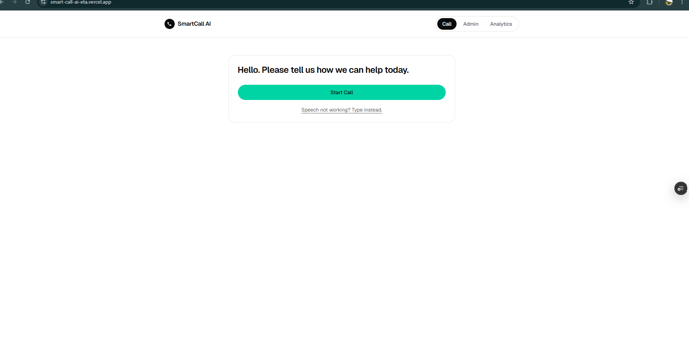

# SmartCall AI

**Skip the menu. Just tell us what's wrong.**

SmartCall AI is an AI-powered call routing platform that replaces traditional IVR phone menus. Instead of "Press 1 for Billing, press 2 for Technical Support", the caller simply says what's wrong in their own words. The AI understands the issue, classifies it, finds an available agent who handles that category, and connects the call — usually in under three seconds.

🔗 **Live demo:** [smart-call-ai-eta.vercel.app](https://smart-call-ai-eta.vercel.app)

---

## The problem

Traditional IVR systems force customers to listen to long menus, memorize option numbers, navigate several levels, and still frequently land in the wrong department — then wait to be transferred again. The result is longer handling times, frustrated customers, higher operational cost, and a support experience nobody enjoys.

## The solution

The customer says:

> "Hi, my internet has been down since yesterday even though I paid."

SmartCall AI then:

1. Converts speech to text in the browser.
2. Classifies the intent with an LLM (`Technical Support`).
3. Writes a short summary, a confidence score, and a plain-English reason for the decision.
4. Finds an available agent who covers that category and marks them busy.
5. Shows the connection screen and logs the call for analytics.

The customer never presses a single number.

---

## Screenshots

### Customer call screen

The caller lands on a single prompt — no menu tree. Speech recognition is the default path, with a typed fallback for browsers or environments where the microphone isn't available.



### Admin dashboard

Manage support agents: create, edit, delete, assign categories, and toggle availability between Available and Busy.


### Analytics dashboard

Routing performance at a glance — total calls, calls today, calls by department, agent availability, average routing time, and average AI confidence.


---

## Features

**Customer call screen** (public, no sign-in)
- One-tap "Start Call" with live speech-to-text transcript
- Typed fallback when speech recognition is unavailable
- AI processing state, then category, summary, confidence, and reasoning
- Low-confidence escape hatch: if the AI isn't sure, the caller can ask for a general agent directly
- Queue message when every agent in a category is busy
- Assigned agent + connection screen

**Admin dashboard** (auth required)
- Full agent CRUD — name, phone, department, handled categories
- Availability toggle
- Search and filter

**Analytics dashboard** (auth required)
- Total calls, calls today, active vs. busy agents
- Calls by department (pie + bar charts via Recharts)
- Average routing time and average AI confidence
- Most common issue category
- Recent calls table

---

## How routing works

```
Customer speaks
      ↓
Browser Web Speech API → transcript
      ↓
POST /api/route-call
      ↓
classifyIssue()  →  { category, summary, confidence, reason }
      ↓
findAvailableAgent(category)
      ↓
Agent marked busy · call persisted
      ↓
"Connecting to Sarah…"
```

Classification runs against the OpenAI API when `OPENAI_API_KEY` is set. If the key is missing or the request fails, it **falls back to a keyword-based classifier** rather than erroring, so the demo always routes. Confidence returned as a `0–1` fraction is normalized to a percentage defensively.

Categories: `Billing`, `Technical Support`, `Sales`, `Insurance`, `Loans`, `Card Support`, `General Inquiry`.

If no agent in the matched category is available, the caller is told they're next in the queue.

---

## Tech stack

| Layer | Choice |
| --- | --- |
| Framework | Next.js 16 (App Router) + React 19 |
| Language | TypeScript |
| Styling | Tailwind CSS v4 + shadcn/ui (Radix) |
| AI | OpenAI API (`gpt-4o-mini`), with a rule-based fallback |
| Speech | Browser Web Speech API |
| Database | Supabase (PostgreSQL) |
| Auth | Supabase Auth (email), via `@supabase/ssr` |
| Charts | Recharts |
| Deployment | Vercel |

> Note: this project targets **Next.js 16**, where the `middleware` convention was renamed to `proxy` — see [proxy.ts](proxy.ts).

---

## Getting started

### 1. Clone and install

```bash
git clone https://github.com/devharunah/SmartCallAI.git
cd SmartCallAI
npm install
```

### 2. Configure environment

Copy the example file and fill in your keys:

```bash
cp .env.local.example .env.local
```

```bash
SUPABASE_URL=
SUPABASE_SERVICE_ROLE_KEY=
OPENAI_API_KEY=

# Browser-visible Supabase config for auth (@supabase/ssr).
NEXT_PUBLIC_SUPABASE_URL=
NEXT_PUBLIC_SUPABASE_PUBLISHABLE_KEY=
```

`NEXT_PUBLIC_SUPABASE_URL` duplicates `SUPABASE_URL` on purpose — `NEXT_PUBLIC_*` vars are inlined into the client bundle at build time, not read at runtime. **Never** prefix the service role key with `NEXT_PUBLIC_`.

`OPENAI_API_KEY` is optional: without it the app runs on the keyword classifier.

### 3. Set up the database

Run [supabase/migrations/0001_init.sql](supabase/migrations/0001_init.sql) against your Supabase project. It creates the `agents` and `calls` tables and seeds nine demo agents across every category.

```bash
supabase db push
```

### 4. Run

```bash
npm run dev
```

Open [http://localhost:3000](http://localhost:3000). Sign up at `/signup` to reach the admin and analytics dashboards.

Speech recognition requires a Chromium-based browser and a secure context (`localhost` or HTTPS). Everywhere else, use the "Speech not working? Type instead." fallback.

---

## Project structure

```
app/
  page.tsx                  Customer call screen (public)
  login/  signup/           Supabase email auth
  (protected)/
    admin/                  Agent management
    analytics/              Routing analytics
  api/
    route-call/             PUBLIC — classify + route + log a call
    agents/                 Auth-gated agent CRUD
    analytics/              Auth-gated metrics
lib/
  classify.ts               OpenAI classifier + keyword fallback
  agents.ts  calls.ts       Data access
  auth.ts                   getClaims(), requireApiUser(), safeNextPath()
  supabase/                 Browser / server / proxy clients
components/
  call-session.tsx          Call flow state machine
  admin-dashboard.tsx
  analytics-dashboard.tsx
supabase/migrations/        Schema + seed data
proxy.ts                    Session refresh (Next.js 16 `proxy`, ex-middleware)
```

### Auth model

`/admin` and `/analytics` require a signed-in user. The proxy is only the optimistic fast path — the authoritative checks live in `app/(protected)/layout.tsx` for pages and `requireApiUser()` for route handlers. `/api/route-call` is deliberately public: customers call it without an account.

---

## Data model

**agents** — `id`, `name`, `phone`, `department`, `categories[]`, `available`

**calls** — `id`, `transcript`, `category`, `summary`, `confidence`, `reason`, `assigned_agent_id`, `assigned_agent_name`, `routing_time_ms`, `created_at`

---

## Demo script

1. Open the app and click **Start Call**.
2. Say: *"My internet has been down since yesterday even though I paid my bill."*
3. Watch the live transcript appear.
4. The AI identifies **Technical Support** and shows its confidence and reasoning.
5. An available agent (e.g. Sarah) is assigned and flipped to busy.
6. Open **Analytics** to see the call logged.

---

## Roadmap

**Phase 2** — real telephony (Twilio / Plivo / Vonage / SIP), automatic transfers, queue management, call recording, AI call summaries, CRM integration, multi-language support (English, Luganda, Swahili).

**Phase 3** — AI voice agent that resolves common questions before escalation, predictive routing from customer history, sentiment analysis to prioritize frustrated callers, AI-driven staffing recommendations.

---

## Why this matters

SmartCall AI isn't trying to replace human support agents — it helps customers reach the right human faster. By understanding issues in natural language instead of rigid IVR menus, organizations reduce transfers, shorten wait times, improve satisfaction, and make better use of their support teams.

---

Built by [@devharunah](https://github.com/devharunah).
